# How to Setup the English Assessment Template
## Part 1: Setting Up the Response Form
### Step 1.) Create a new Folder

Go the location of the "English Assessment Template" Folder in your Google Drive

In the top-left corner of the screen you will see a button labeled "NEW". Press this button, and select the option labeled "Folder".

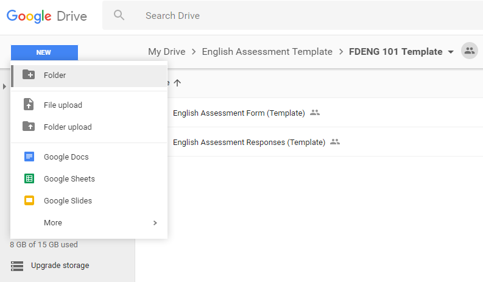

Type the course code followed by the section number into the text box and then click create.

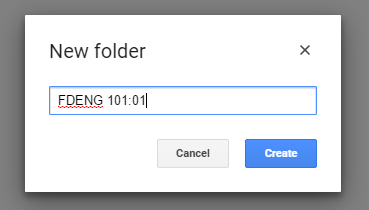

### Step 2.) Copy the Template

Your Google Drive folder should now look similar to this.

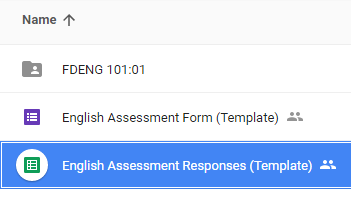

Right click on the item labeled "English Assessment Responses (Template)" and then select the option "Make a copy" from the drop-down menu.

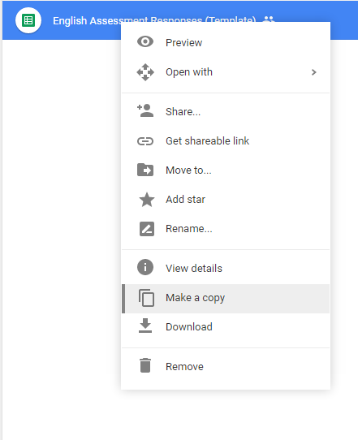

You will need to wait for a minute or two while the Google Drive copies the files. 

Once it is done copying the spreadsheet, you should see two new files.
Click and drag your cursor over the new files to select them then drag them to the folder you just created to move them there.


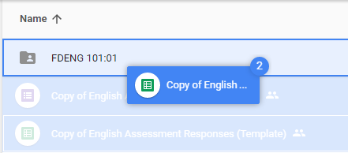
```
Note: If you receive a message saying  "Some people may lose access", ignore it and just press "OK".
```

Once the files have been transferred, double-click the folder to open it. Once you are inside the folder, you should be able to see the two file you move into there.
Right click on one of the files and select the option "Rename..." from the menu that appears.

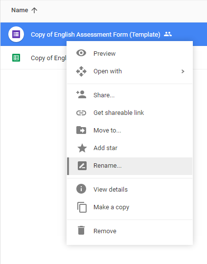

When prompted, delete "Copy of English" from the textbox and then replace it with your course code and section. Also, be sure to delete "(Template)" from the back of the textbox as well. Once you have done this, click "OK".

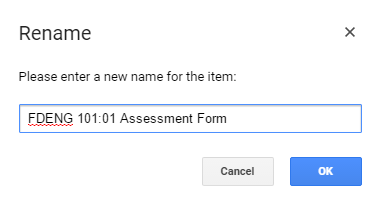

Now do the same thing with the other file in the folder.

Once you are done, your file should look like this.

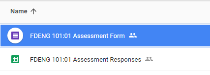

### Step 3.) Setup the Form

Now double click on the assessment form to open it.

You should now see a page that is similar to this. 

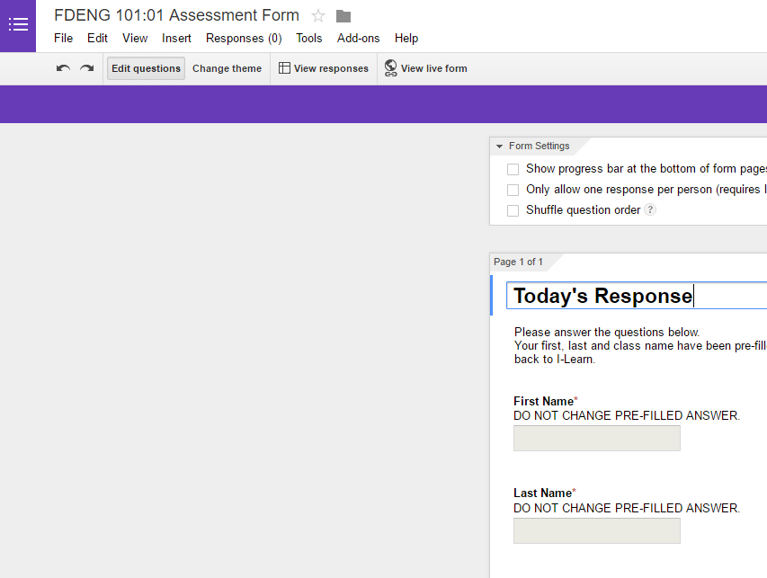

Scroll down until you see the option that says "Question: What is the mist important thing that happened today..." and then click on the pencil icon.

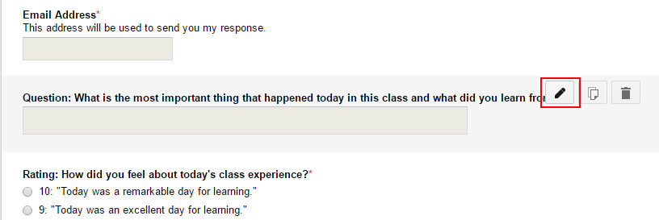

From here you can modify the question title to be the question that you would like your students to respond to. However the phrase "Question:" must be 
at the **beginning of your question** or **the program will malfunction later on**.

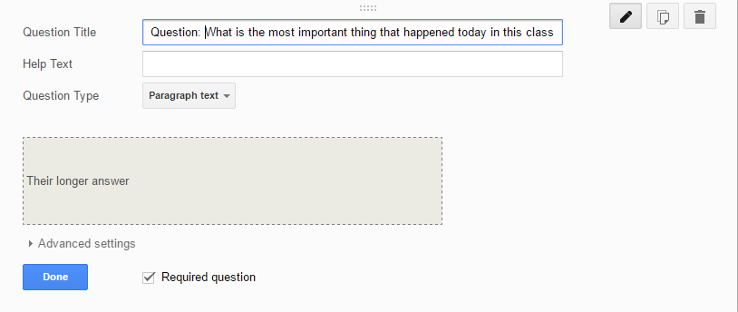

Once you have made the desired changes, click "Done" in the bottom left corner to save your changes.

If you look at the top-left of your screen, you will see a menu called responses. Click on this menu and click on the option labeled "Get pre-filled URL".


You will be taken to the Google Form and you will be asked to fill it out. You will only need to fill out the first three values of the form.
Below is a table of the specific values that you need to place into each field. You must do the exact value from the table or the program will malfunction later on.

```
Note: Don't fill any fields other than the ones specified in the table below.
```

|     Field|        Value|
|:--------:|:-----------:|
|First Name|{FirstName}  |
|Last Name |{LastName}   |
|Class Name|{OrgUnitName}|
|Day       |$DAY$        |

Once you have filled out these three elements, your form should look **exactly** like this.

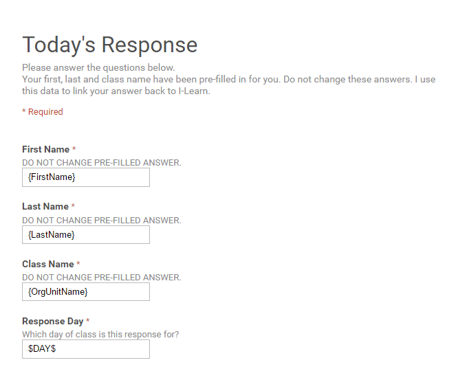

**
Please double check and make sure that the values are correct!** 
Once you have done this, scroll to the bottom of the form, ignoring the other fields, and press the blue button on the bottom that says "Submit".

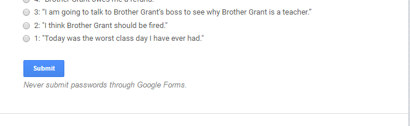

You should now see a box prompting you to copy the link inside. Copy the link and paste it into a safe place. You will need this for the next step.
```
Note: Don't close out of this tab until you have completed the first part of the setup. If you lose the link, you will need to go through Step 3 all over again.
```


### Step 4.) Generate the Daily Links

We are almost done with the first part.

Go back to the Google Drive folder.  This time, open the "Assessment Responses" spreadsheet.

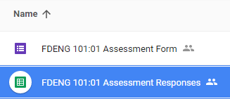

You should now be seeing something similar to this.

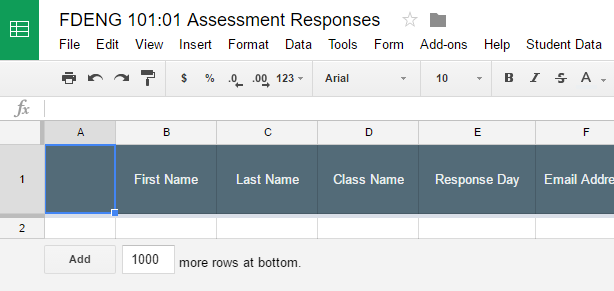

At the bottom of the page, you should see several tabs. Click the tab labeled "Form Response Links" to open it.

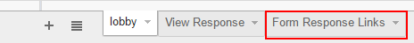

Once the tab is open, right-click on the cell beneath "Form Link" and paste the link that you copied from the Google Form.

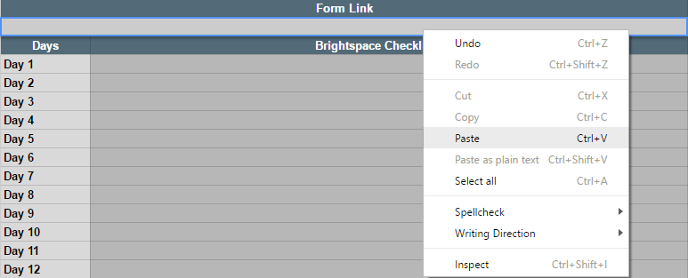

You should see the cells below populate with links. 


We are now done with the first part of the setup process!

Just to make sure that everything is set up correctly, copy the link next to the "Day 1" cell and then paste it into a new browser tab. 

Navigate to the link and your form should look the same as when you filled it out in step three. However, if you look at the response day, you will notice that instead of the value being "$DAY$" it is now "Day 1". 

If your form looks like this, then you are ready to move on to part two.

If you form does not look like this, please repeat Step 3 and Step 4.   


