# How to Setup the English Assessment Template
## Part 2: Linking to Brightspace
### Step 1.) Make the Checklist
Login to Brightspace and open the course that you would like to link to the Google Form.

Once you are in the course, click on the "Teaching Tools" menu item and then select the option "Course Admin".

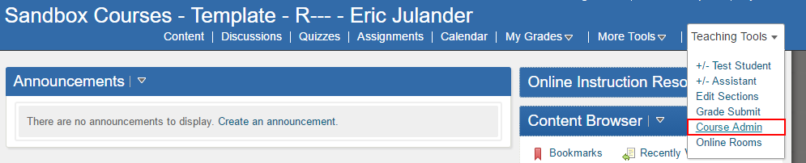

Go down to the "Assessment" section and click on "Checklists"

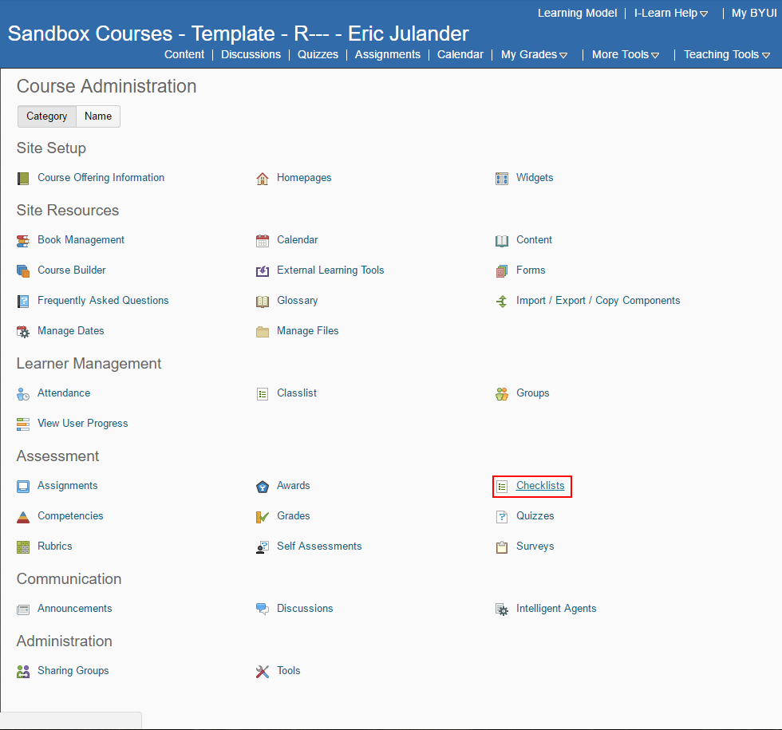

Once you are on this page, click the button labeled "New Checklist" in the top-left of your screen. 

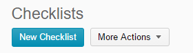

You will then be prompted to provide a name and a description for the new checklist. After you give the checklist a name and a description, click the button labeled "Save" in the bottom-left of the screen. 

~~~
Note: Descriptions for these items are optional.
~~~

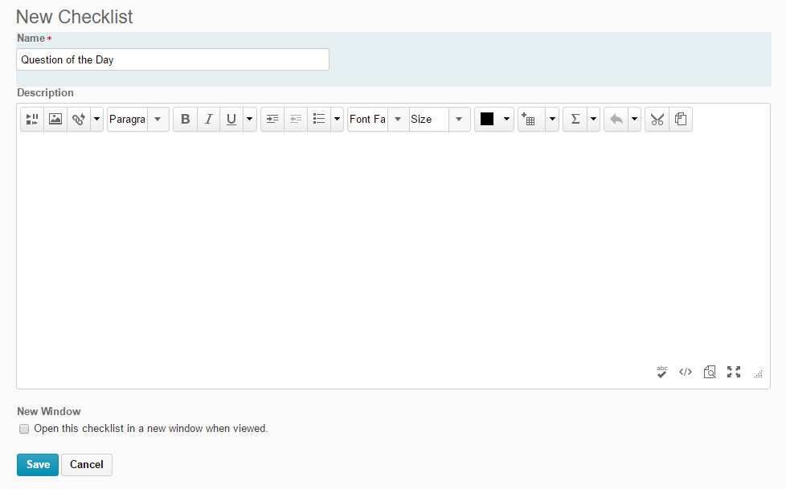

You should now see the "Edit Checklist" screen. Click on the button labeled "New Category" in the bottom-left of the screen.

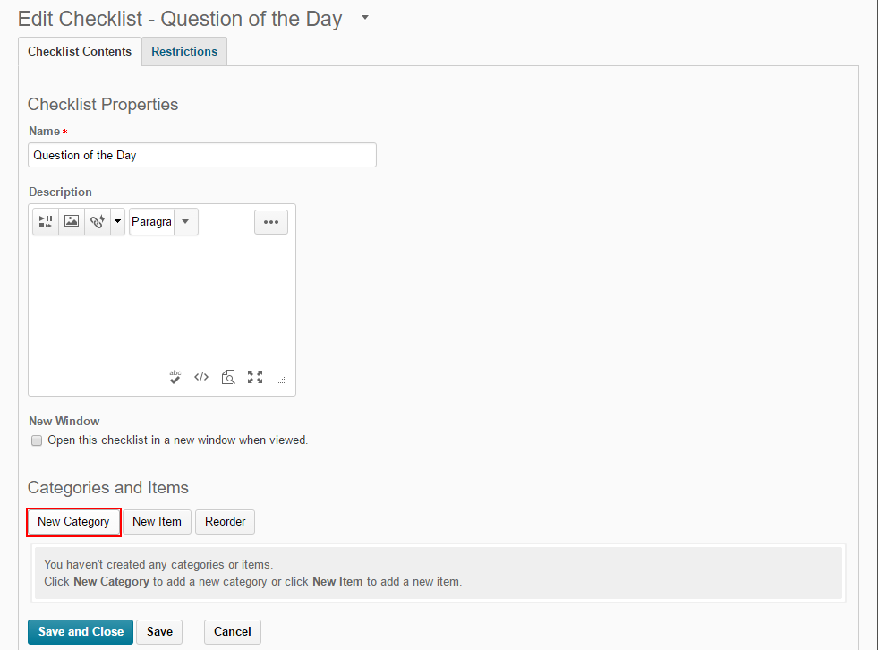

Provide the category with a new name and a description. After that, click the button labeled "Save" in the bottom-left corner.

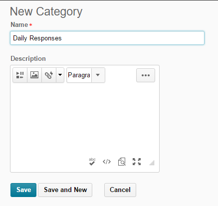

### Step 2.) Create a Response Day

Once you have clicked save, you should find yourself back in the "Edit Checklist" screen. This time, click on the button labeled "New Item".

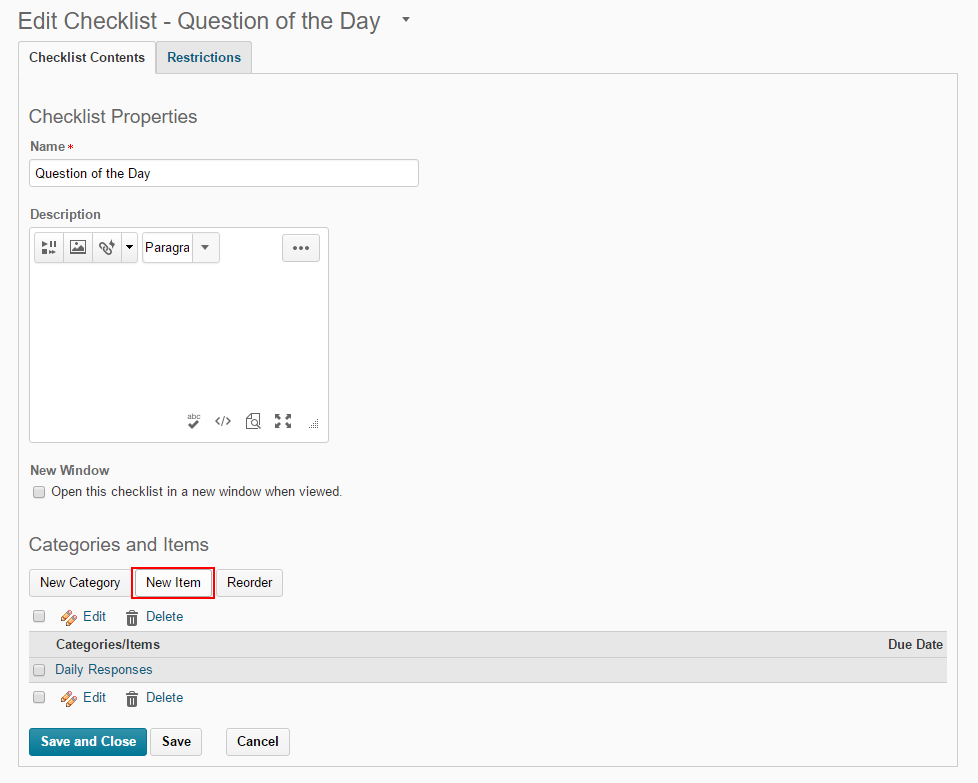

Now that you are on the "Edit Item" screen, make sure that the field "Category" matches the name of the category that you created back in Step 1. 
~~~
Note: If it does not match, press the down-arrow by the category name and select the proper category from the menu that appears. 
~~~

Now put the day for the question response in the "Name" field
~~~
Example: The response for the first day would be "Day 1".
~~~

In the description, type "Submit response for Day" and then the current day number.

~~~
Example: The description for the first day would be, "Submit response for Day 1".
~~~

Once you have typed the description, select the description text and then press the link button in the top-left of the description box. 

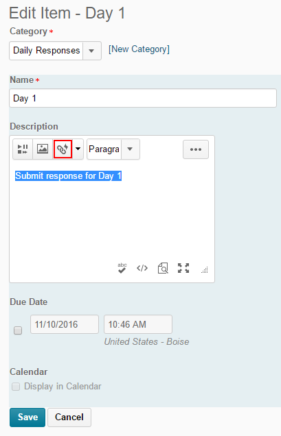

You will now see the "Insert Quicklink" menu. Scroll to the bottom of the menu and select the option "Url".

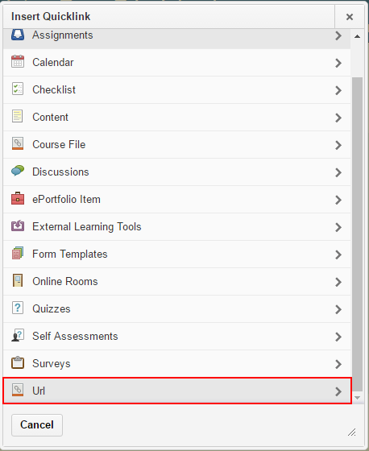

Now go back to the spreadsheet that we created in Part 1. In the tab labeled "Form Response Links" You should see a list of days and their associated Brightspace checklist links. Go through the list and find the response day that corresponds with the checklist item that you are creating. Once you have found the appropriate day, copy the link to its right underneath the column labeled "Brightspace Checklist Link"

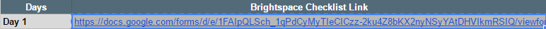

~~~
Note: If the links next to the Days are not populated, got pack to Part 1 and repeat Steps 3 & 4.
~~~

Now that you have the link copied, go back to Brightspace and paste it into the "URL" field under the "Insert Quicklink" page. Now, select the "New Window " option under the "Target" field and the press the button labeled "Insert" in the bottom-left of the screen.

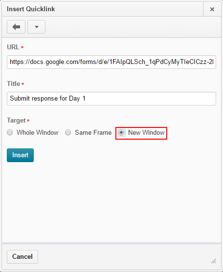

Now that you are on the "Edit Item" screen again, click the "Preview" option, the image of a paper with a magnifying glass, in the bottom-right section of the description box.

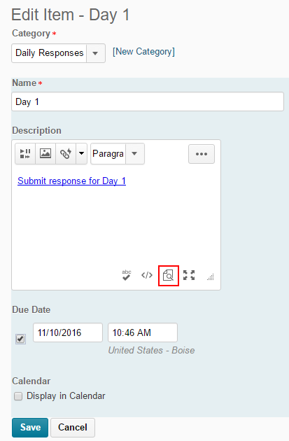

Now click on the link in the "Preview" window. It should take you to the Google Form, but his time you should see your real first name, last name, class name, and the associated response day. If any of these are incorrect, go back to Part 1 and repeat Steps 3 & 4 and then repeat Step 2 of this part.

If the form is accurate, go back to Brightspace and close out of the "Preview" window by clicking on the button labeled "Close" in the bottom-left corner. 

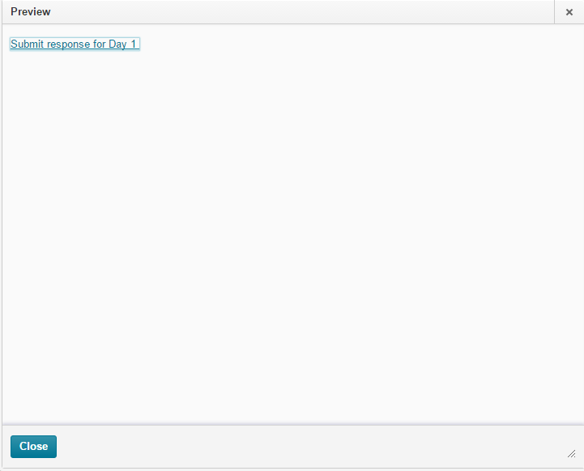

Under the "Description" section, you will see a section labeled "Due Date". Click on the checkbox below and then insert the date and time that you would like this response to be due.

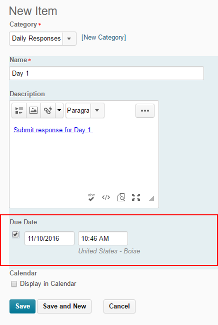

Once you have done this, also be sure to check the option "Display in Calendar" under the "Calendar" section. 

Click the button Labeled "Save" in the bottom-left corner of the page and you have officially completed Part 2!

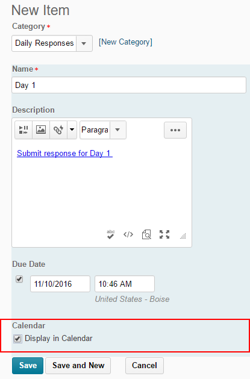

Just repeat Step 2 for all of the remaining response days and then your response form should be fully operational now.

